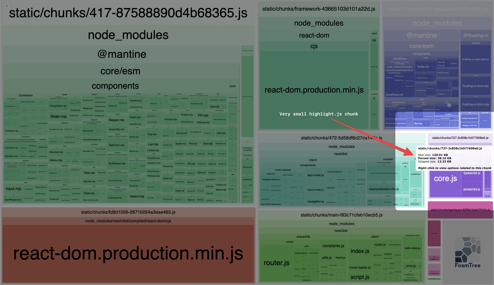

## Bundle Analyzer Result



## How to test

Clone this repository. Then, clone Mantine's repository to the same directory and checkout to `ibedwi:feat/code-highlight-lite` branch.

First, enter Mantine's repository. Follow the contribution guide of Mantine. Install the its dependencies. Then build `@mantine/code-highlight-lite` package using this command:

```bash
yarn build @mantine/code-highlight-lite
```

Then, enter this project directory. Install this project's dependencies. Then, install the bundled package using this command:

```bash
yarn build ../mantine/packages/mantine-code-highlight-lite
```

Finally, run the development server using this command:

```bash
yarn dev
```
